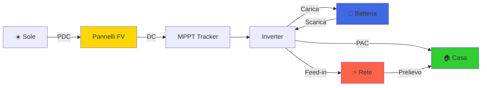

# Energy Flow Interpretation Guide

## ⚠️ IMPORTANTE: Differenza tra Produzione FV e Output Inverter

Questo documento spiega come interpretare correttamente i dati dell'inverter, **specialmente in sistemi ibridi con batteria**.

---

## 🔑 Concetti Chiave

### 1. **Produzione Fotovoltaica (DC Power)** 
**Parametri**: `mpp[x].pdc`, `DcMsWatt`
- ✅ **È la VERA produzione dai pannelli solari**
- Misurata sul lato DC (corrente continua)
- Somma di tutti gli MPPT (Maximum Power Point Trackers)
- **Zero di notte o con pannelli coperti**

```python
# Produzione FV reale
pv_production = sum(mpp.pdc for mpp in data.mpp.values())
```

### 2. **Output Inverter (AC Power)**
**Parametri**: `total_pac`, `GridMsTotW`
- ⚠️ **NON è sempre uguale alla produzione FV!**
- Misurata sul lato AC (corrente alternata)
- **Include energia dalla batteria se sta scaricando**
- Può essere > 0 anche di notte (batteria → casa)

```python
# Output totale inverter (può includere batteria!)
inverter_output = data.total_pac
```

---

## 🔋 Flussi Energetici nei Sistemi Ibridi

### Scenario 1: Giorno - Solo FV
```
☀️ Pannelli: 3.0 kW (PDC)
🔋 Batteria: 0 kW (idle)
⚡ Output:   3.0 kW (PAC)

PDC = PAC (meno perdite conversione)
```

### Scenario 2: Giorno - FV + Carica Batteria
```
☀️ Pannelli: 5.0 kW (PDC)
🔋 Batteria: +2.0 kW (carica)
⚡ Output:   3.0 kW (PAC verso casa)
🏠 Rete:     0 kW

PDC = PAC + Carica Batteria
```

### Scenario 3: Notte - Solo Batteria
```
☀️ Pannelli: 0 kW (PDC) ← NESSUNA PRODUZIONE FV!
🔋 Batteria: -1.5 kW (scarica)
⚡ Output:   1.5 kW (PAC dalla batteria)

❌ ERRORE COMUNE: Pensare che PAC = produzione solare
✅ CORRETTO: PAC proviene dalla batteria, non dal sole!
```

### Scenario 4: Giorno - FV + Scarica Batteria
```
☀️ Pannelli: 2.0 kW (PDC)
🔋 Batteria: -1.0 kW (scarica)
⚡ Output:   3.0 kW (PAC)

PAC = PDC + Scarica Batteria
```

---

## 📊 Parametri Chiave dall'Inverter

### DC Side (Lato Pannelli)
| Parametro | Significato | Note |
|-----------|-------------|------|
| `mpp[x].pdc` | Potenza DC per stringa | Vera produzione FV |
| `mpp[x].udc` | Tensione DC | V × 100 |
| `mpp[x].idc` | Corrente DC | mA |
| `DcMsWatt` | Comando LRI per PDC | Query dati DC |

### AC Side (Lato Casa/Rete)
| Parametro | Significato | Note |
|-----------|-------------|------|
| `total_pac` | Output totale AC | Può includere batteria! |
| `pac1/2/3` | Potenza per fase | W |
| `GridMsTotW` | Potenza AC totale | Comando LRI |

### Battery (Batteria)
| Parametro | Significato | Note |
|-----------|-------------|------|
| `bat_current` | Corrente batteria | + carica, - scarica |
| `bat_voltage` | Tensione batteria | V × 100 |
| `bat_charge_status` | Livello carica | % (0-100) |

### Grid Metering (Rete)
| Parametro | Significato | Note |
|-----------|-------------|------|
| `metering_grid_w_out` | Potenza verso rete | Feed-in (immissione) |
| `metering_grid_w_in` | Potenza dalla rete | Prelievo |

---

## 🧮 Calcoli dei Flussi Energetici

### Produzione Fotovoltaica Totale
```python
pv_production_w = sum(mpp.pdc for mpp in data.mpp.values())
```

### Flusso Batteria
```python
# bat_current in mA
# > 0 = carica (energia va NELLA batteria)
# < 0 = scarica (energia ESCE dalla batteria)

battery_power_w = (data.bat_voltage / 100.0) * (data.bat_current / 1000.0)
# Positivo = carica, Negativo = scarica
```

### Consumo Casa Stimato
```python
house_consumption = (
    pv_production_w +           # Energia dai pannelli
    abs(battery_power_w) +      # Energia dalla batteria (se scarica)
    data.metering_grid_w_in -   # Energia prelevata dalla rete
    data.metering_grid_w_out    # Energia immessa in rete
)
```

### Bilancio Energetico
```python
# Equazione fondamentale:
# PDC + Batteria_Out = PAC + Batteria_In + Perdite
```

---

## ⚡ Energy Flow Diagram



---

## 🎯 Best Practices per il Monitoraggio

### ✅ DO (Fare)
1. **Usare PDC per la produzione solare effettiva**
2. **Controllare bat_current per capire se la batteria contribuisce**
3. **Confrontare PDC vs PAC per vedere il ruolo della batteria**
4. **Mostrare chiaramente le fonti energetiche separatamente**

### ❌ DON'T (Non Fare)
1. ❌ Usare PAC come indicatore di produzione solare
2. ❌ Ignorare la batteria nei calcoli energetici
3. ❌ Confondere output inverter con generazione FV
4. ❌ Sommare PDC e PAC (sono flussi diversi!)

---

## 🔍 Esempio Pratico

### Output Monitor Corretto
```
══════════════════════════════════════
ENERGY FLOW ANALYSIS
══════════════════════════════════════

SOLAR PRODUCTION (DC)
  String 1:        1.2 kW @ 380V
  String 2:        1.3 kW @ 385V
  Total Solar:     2.5 kW ← PRODUZIONE FV REALE

BATTERY STATUS
  Charge Level:    75%
  Power Flow:      -0.8 kW (Discharging) ← BATTERIA FORNISCE ENERGIA
  
INVERTER OUTPUT (AC)
  Total Output:    3.3 kW ← SOMMA FV + BATTERIA
  
ENERGY BALANCE
  PV Production:   2.5 kW (pannelli)
  Battery Out:     0.8 kW (batteria → casa)
  Inverter Out:    3.3 kW (verso casa/rete)
  ✓ Balance OK: 2.5 + 0.8 = 3.3
```

### Output Monitor Sbagliato
```
❌ SBAGLIATO:
AC Power: 3.3 kW
(Sembra che i pannelli producano 3.3 kW, ma 0.8 kW viene dalla batteria!)
```

---

## 📚 Riferimenti Tecnici

### Comandi LRI (Logical Record Identifier)
```python
# Produzione DC (pannelli)
DcMsWatt = 0x00251E00      # DC power (PDC)
DcMsVol = 0x00451F00       # DC voltage (UDC)
DcMsAmp = 0x00452100       # DC current (IDC)

# Output AC (inverter)
GridMsTotW = 0x00263F00    # Total AC power
GridMsWphsA/B/C = 0x464000 # AC power per phase

# Batteria
BatAmp = 0x00495D00        # Battery current
BatVol = 0x00495C00        # Battery voltage
BatChaStt = 0x00295A00     # Charge status

# Grid Metering
MeteringGridMsTotWOut = 0x00463600  # Grid feed-in
MeteringGridMsTotWIn = 0x00463700   # Grid consumption
```

---

## 🚨 Casi Limite e Note

### Di Notte (PDC = 0)
- Se PAC > 0 → Energia dalla batteria o rete
- Se bat_current < 0 → Batteria in scarica
- **Non confondere con produzione solare!**

### Efficienza Inverter
```python
if pv_production_w > 0:
    efficiency = (total_pac / pv_production_w) * 100
    # Tipicamente 95-98%
```

### Time-of-Use (Orari)
- **06:00-20:00**: Possibile PDC > 0 (controllare sempre!)
- **20:00-06:00**: PDC = 0 garantito, PAC solo da batteria/rete

---

## 📝 Checklist Implementazione

- [ ] Mostrare PDC separato da PAC
- [ ] Indicare direzione flusso batteria (carica/scarica)
- [ ] Calcolare bilancio energetico
- [ ] Evidenziare fonte energia (sole vs batteria)
- [ ] Validare coerenza dati (PDC + Bat ≈ PAC)
- [ ] Documentare units e conversioni (V×100, mA, etc.)

---

**Documento creato**: 2026-02-02  
**Autore**: SBFspot Python Port Documentation  
**Versione**: 1.0
